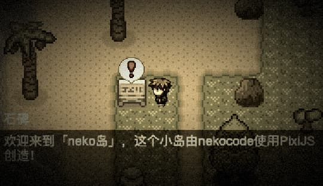

|  |
| --- |

## neko 岛🏝

使用 PixiJS + TiledMap 实现的个人小岛

在线演示: [nekocode.cn](https://nekocode.cn/)

* 为了兼顾没有键盘的移动端，所以选择了使用鼠标/触摸点击的方式进行交互

* shader 滤镜: sepia + bulgePinch + brightnessContrast + vignette + noise

* 寻路算法: [PathFinding.js](https://github.com/qiao/PathFinding.js)

* 地图编辑器: [Tiled](https://www.mapeditor.org/)
